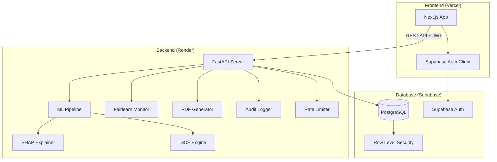
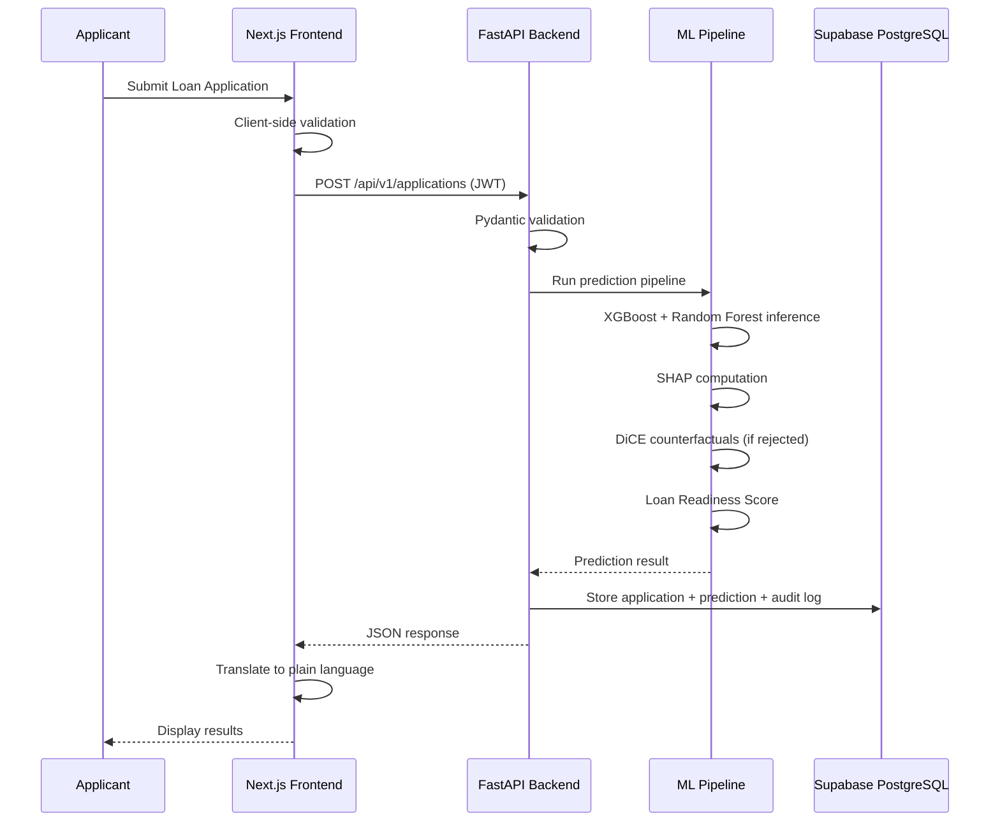
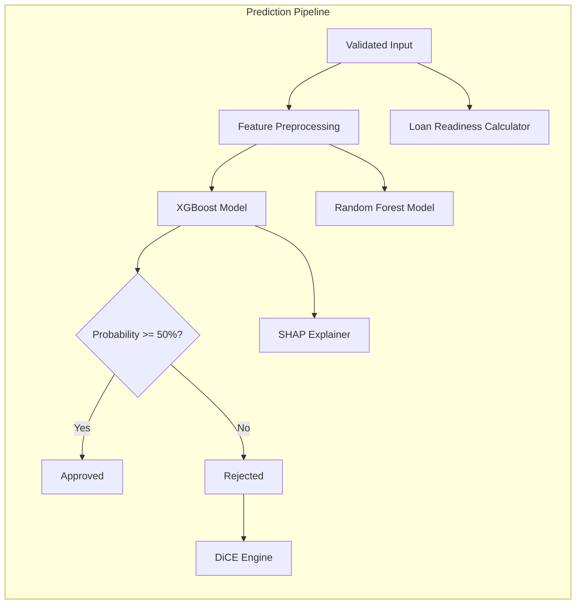
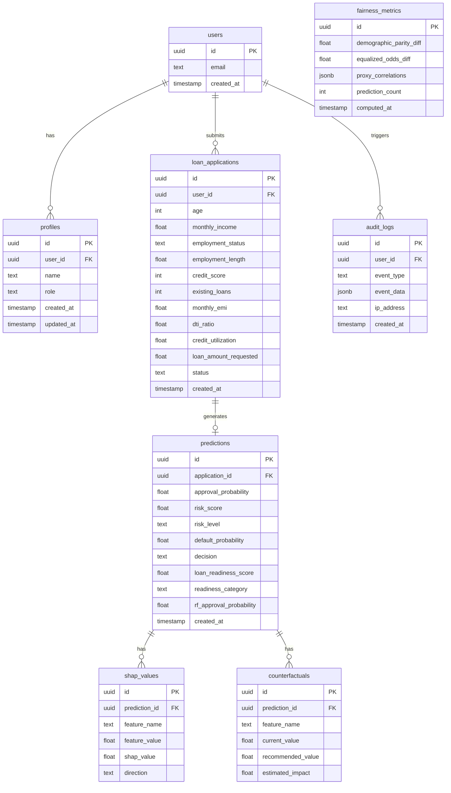

# Technical Design Document

## Overview

This document describes the technical design for the Explainable & Fair AI-Powered Loan Decision Support Platform. The platform is a full-stack web application that combines machine learning prediction with explainability (SHAP, DiCE counterfactuals), fairness monitoring (Fairlearn), and human-readable explanations to support transparent lending decisions.

The system follows a three-tier architecture:
- **Frontend**: Next.js (TypeScript) deployed on Vercel — handles UI rendering, client-side validation, and session management
- **Backend**: FastAPI (Python) deployed on Render — handles business logic, ML inference, explainability computation, and API security
- **Database**: Supabase PostgreSQL — handles data persistence, authentication, and row-level security

Key design goals:
1. All applicant-facing content uses plain, non-technical language
2. Predictions are explainable via SHAP values and actionable via counterfactual recommendations
3. Fairness is monitored using Demographic Parity and Equalized Odds metrics
4. The system maintains a complete audit trail for regulatory compliance
5. The What-If Simulator provides real-time prediction without formal submission or audit logging

## Architecture

### High-Level System Architecture



### Request Flow



### Deployment Architecture

| Component | Platform | URL Pattern | Notes |
|-----------|----------|-------------|-------|
| Frontend | Vercel | `https://app.example.com` | Edge-deployed, automatic HTTPS |
| Backend | Render | `https://api.example.com` | Web service, auto-scaling |
| Database | Supabase | Managed connection string | Connection pooling via Supavisor |
| Auth | Supabase Auth | Integrated with DB | JWT-based, handles refresh |

### Cross-Origin Configuration

The FastAPI backend configures CORS to allow requests only from the Vercel frontend domain. The frontend sends the Supabase JWT in the `Authorization: Bearer <token>` header with every API request.


## Components and Interfaces

### Frontend Components

#### Page Structure

| Route | Role | Component | Description |
|-------|------|-----------|-------------|
| `/login` | Public | `LoginPage` | Email/password authentication |
| `/register` | Public | `RegisterPage` | New user registration |
| `/applicant/dashboard` | Applicant | `ApplicantDashboard` | Central hub for applicants |
| `/applicant/apply` | Applicant | `LoanApplicationForm` | Loan application submission |
| `/applicant/history` | Applicant | `AssessmentHistory` | Paginated past assessments |
| `/applicant/assessment/[id]` | Applicant | `AssessmentDetail` | Full assessment with explanations |
| `/applicant/simulator` | Applicant | `WhatIfSimulator` | Interactive prediction simulator |
| `/officer/dashboard` | Bank_Officer | `OfficerDashboard` | Application review hub |
| `/officer/applications` | Bank_Officer | `ApplicationReview` | Paginated application list |
| `/officer/applications/[id]` | Bank_Officer | `ApplicationDetail` | Full application with explanations |
| `/officer/analytics` | Bank_Officer | `RiskAnalytics` | Risk analytics and model stats |
| `/admin/dashboard` | Admin | `AdminDashboard` | Admin monitoring hub |
| `/admin/fairness` | Admin | `FairnessMonitoring` | Fairness metrics display |
| `/admin/users` | Admin | `UserManagement` | Read-only user list |
| `/admin/audit` | Admin | `AuditLogs` | Paginated audit log viewer |
| `/admin/models` | Admin | `ModelStatistics` | Model performance comparison |

#### Key Frontend Services

```typescript
// Auth service - wraps Supabase Auth client
interface AuthService {
  register(name: string, email: string, password: string): Promise<AuthResult>;
  login(email: string, password: string): Promise<AuthResult>;
  logout(): Promise<void>;
  getSession(): Promise<Session | null>;
  onAuthStateChange(callback: (session: Session | null) => void): Unsubscribe;
}

// API client - handles authenticated requests to FastAPI backend
interface ApiClient {
  submitApplication(data: LoanApplicationInput): Promise<PredictionResult>;
  simulateWhatIf(data: LoanApplicationInput): Promise<SimulationResult>;
  getAssessmentHistory(page: number): Promise<PaginatedAssessments>;
  getAssessment(id: string): Promise<AssessmentDetail>;
  downloadReport(assessmentId: string): Promise<Blob>;
  getApplications(page: number): Promise<PaginatedApplications>;  // Officer
  getFairnessMetrics(): Promise<FairnessMetrics>;  // Admin
  getAuditLogs(filters: AuditFilters, page: number): Promise<PaginatedAuditLogs>;  // Admin
  getUsers(page: number): Promise<PaginatedUsers>;  // Admin
  getModelStats(): Promise<ModelStatistics>;  // Officer/Admin
}

// Explanation translator - converts technical metrics to plain language
interface ExplanationTranslator {
  translateShapValues(shapValues: ShapValue[]): PlainLanguageExplanation[];
  translateCounterfactuals(counterfactuals: Counterfactual[]): PlainLanguageRecommendation[];
  translateReadinessScore(score: number): ReadinessInterpretation;
  getFeatureDisplayName(technicalName: string): string;
}
```

### Backend API Endpoints

#### Authentication Endpoints

| Method | Path | Auth | Description |
|--------|------|------|-------------|
| POST | `/api/v1/auth/register` | None | Register new user |
| POST | `/api/v1/auth/login` | None | Authenticate user |
| POST | `/api/v1/auth/logout` | JWT | Invalidate session |

#### Application Endpoints

| Method | Path | Auth | Role | Description |
|--------|------|------|------|-------------|
| POST | `/api/v1/applications` | JWT | Applicant | Submit loan application |
| GET | `/api/v1/applications` | JWT | Applicant | List own applications (paginated) |
| GET | `/api/v1/applications/{id}` | JWT | Applicant/Officer | Get application detail |
| GET | `/api/v1/applications/review` | JWT | Officer | List all applications for review |

#### Prediction Endpoints

| Method | Path | Auth | Role | Description |
|--------|------|------|------|-------------|
| POST | `/api/v1/predictions/simulate` | JWT | Applicant | What-If simulation (no audit) |

#### Report Endpoints

| Method | Path | Auth | Role | Description |
|--------|------|------|------|-------------|
| GET | `/api/v1/reports/{assessment_id}/pdf` | JWT | Applicant | Download PDF report |

#### Admin Endpoints

| Method | Path | Auth | Role | Description |
|--------|------|------|------|-------------|
| GET | `/api/v1/admin/fairness` | JWT | Admin | Get fairness metrics |
| GET | `/api/v1/admin/users` | JWT | Admin | List users (paginated) |
| GET | `/api/v1/admin/audit-logs` | JWT | Admin | Get audit logs (paginated, filterable) |
| GET | `/api/v1/admin/model-stats` | JWT | Admin/Officer | Get model performance metrics |

#### Request/Response Schemas

```python
# Loan Application Input
class LoanApplicationInput(BaseModel):
    age: int = Field(ge=18, le=100)
    monthly_income: float = Field(gt=0, le=10_000_000)
    employment_status: Literal["Employed", "Self-Employed", "Unemployed", "Retired"]
    employment_length: float = Field(ge=0, le=50)
    credit_score: int = Field(ge=300, le=850)
    existing_loans: int = Field(ge=0, le=50)
    monthly_emi: float = Field(ge=0)
    dti_ratio: float = Field(ge=0, le=100)
    credit_utilization: float = Field(ge=0, le=100)
    loan_amount_requested: float = Field(gt=0, le=10_000_000)

    @validator("monthly_emi")
    def emi_not_exceeding_income(cls, v, values):
        if "monthly_income" in values and v > values["monthly_income"]:
            raise ValueError("Monthly EMI cannot exceed Monthly Income")
        return v

# Prediction Result
class PredictionResult(BaseModel):
    application_id: str
    approval_probability: float  # 0-100
    risk_score: float  # 0-100
    risk_level: Literal["Very Low Risk", "Low Risk", "Moderate Risk", "High Risk", "Very High Risk"]
    default_probability: float  # 0-100
    decision: Literal["Approved", "Rejected"]
    loan_readiness_score: float  # 0-100
    readiness_category: Literal["Poor", "Fair", "Good", "Excellent"]
    shap_values: list[ShapValue]
    top_factors: list[ShapValue]  # Top 3 by absolute magnitude
    counterfactuals: list[Counterfactual] | None  # Only for Rejected
    rf_approval_probability: float  # Random Forest comparison
    timestamp: datetime

class ShapValue(BaseModel):
    feature: str
    value: float  # The input value
    shap_value: float  # SHAP contribution
    direction: Literal["positive", "negative"]

class Counterfactual(BaseModel):
    feature: str
    current_value: float
    recommended_value: float
    projected_approval_probability: float
    projected_risk_score: float
    projected_risk_level: Literal["Very Low Risk", "Low Risk", "Moderate Risk", "High Risk", "Very High Risk"]
    projected_loan_readiness_score: float

# Simulation Result (What-If)
class SimulationResult(BaseModel):
    approval_probability: float
    risk_score: float
    risk_level: Literal["Very Low Risk", "Low Risk", "Moderate Risk", "High Risk", "Very High Risk"]
    loan_readiness_score: float
    readiness_category: Literal["Poor", "Fair", "Good", "Excellent"]
    decision: Literal["Approved", "Rejected"]
```

### Backend Service Layer

```python
# Core services
class PredictionService:
    """Orchestrates the ML prediction pipeline."""
    def predict(self, input: LoanApplicationInput) -> PredictionResult: ...
    def simulate(self, input: LoanApplicationInput) -> SimulationResult: ...

class ShapExplainerService:
    """Computes SHAP values for predictions."""
    def compute_local_shap(self, input: np.ndarray) -> list[ShapValue]: ...
    def compute_global_importance(self) -> list[FeatureImportance]: ...

class CounterfactualService:
    """Generates DiCE counterfactual explanations."""
    def generate(self, input: LoanApplicationInput, num_cfs: int = 3) -> list[Counterfactual]: ...

class LoanReadinessService:
    """Computes the Loan Readiness Score."""
    def compute(self, input: LoanApplicationInput) -> tuple[float, str]: ...

class FairnessService:
    """Computes fairness metrics using Fairlearn."""
    def compute_metrics(self) -> FairnessMetrics: ...
    def detect_proxy_bias(self) -> list[ProxyBiasResult]: ...

class AuditService:
    """Handles audit log persistence."""
    def log_prediction(self, event: PredictionAuditEvent) -> None: ...
    def log_auth_event(self, event: AuthAuditEvent) -> None: ...
    def get_logs(self, filters: AuditFilters, page: int) -> PaginatedAuditLogs: ...

class PDFReportService:
    """Generates PDF assessment reports."""
    def generate(self, assessment: AssessmentDetail) -> bytes: ...
```


### ML Pipeline Architecture



#### Model Training and Serving

- **Dataset**: Give Me Some Credit (Kaggle) — preprocessed and split 80/20 train/test
- **XGBoost**: Primary model. Hyperparameters tuned via Optuna. Outputs probability of default.
- **Random Forest**: Secondary model for comparison. Same train/test split.
- **Serving**: Models are serialized with `joblib` and loaded at FastAPI startup. No real-time retraining.
- **Approval Logic**: `Approval_Probability = (1 - Default_Probability) * 100`. Decision threshold: 50%.
- **Risk Score**: `Risk_Score = Default_Probability * 100` (0 = Very Low Risk, 100 = Very High Risk). Risk Level categories: Very Low Risk (0-20), Low Risk (21-40), Moderate Risk (41-60), High Risk (61-80), Very High Risk (81-100).

#### SHAP Explainer

- Uses `shap.TreeExplainer` for XGBoost model
- Computes local SHAP values per prediction (10 features)
- Global feature importance computed across all stored predictions (batch, on-demand for Officer view)
- SHAP values stored in database per prediction for audit trail

#### DiCE Counterfactual Engine

- Uses `dice_ml` library with the trained XGBoost model
- Generates 1-3 counterfactuals per rejected application
- **Immutable features**: Age only
- **Mutable features**: Monthly Income, Employment Status, Employment Length, Credit Score, Existing Loans, Monthly EMI, DTI_Ratio, Credit Utilization, Loan Amount Requested
- Feature ranges constrained to Requirement 4 validation bounds
- Prioritizes minimal changes via DiCE's proximity weight
- Each counterfactual includes projected approval probability (re-run through XGBoost)
- Timeout: 10 seconds. Falls back to top-3 SHAP features as general improvement areas.

#### Loan Readiness Score Calculator

Formula:
```
LRS = (credit_score_normalized * 0.30) +
      (dti_ratio_score * 0.25) +
      (credit_utilization_score * 0.20) +
      (employment_length_score * 0.15) +
      (existing_loans_score * 0.10)
```

Normalization:
- `credit_score_normalized`: `(credit_score - 300) / (850 - 300) * 100`
- `dti_ratio_score`: `(1 - dti_ratio / 100) * 100` (lower DTI = better)
- `credit_utilization_score`: `(1 - credit_utilization / 100) * 100` (lower utilization = better)
- `employment_length_score`: `min(employment_length / 10, 1) * 100` (capped at 10 years)
- `existing_loans_score`: `max(0, (1 - existing_loans / 10)) * 100` (fewer loans = better, capped at 10)

Categories:
- 0-25: Poor (red)
- 26-50: Fair (orange)
- 51-75: Good (yellow)
- 76-100: Excellent (green)

### What-If Simulator

The What-If Simulator is a lightweight prediction endpoint that:
1. Accepts the same `LoanApplicationInput` schema
2. Runs XGBoost inference + Loan Readiness Score calculation
3. Returns `SimulationResult` (approval probability, risk score, readiness score, decision)
4. Does NOT compute SHAP values or counterfactuals (for speed)
5. Does NOT store results in the database
6. Does NOT trigger audit logging
7. Target response time: < 2 seconds

The frontend displays a side-by-side comparison of original vs. simulated values with directional indicators (↑ improvement, ↓ decline).

### Human-Readable Explanation Layer

The frontend `ExplanationTranslator` service converts technical outputs to plain language:

| Technical Term | Plain Language Equivalent |
|---------------|--------------------------|
| DTI_Ratio | Portion of income going toward debt |
| Credit Utilization | How much of your credit limit you're using |
| SHAP Value (positive) | "This factor helped your application" |
| SHAP Value (negative) | "This factor worked against your application" |
| Employment Length | How long you've been at your current job |
| Existing Loans | Number of current active loans |
| Credit Score | Your credit score |
| Monthly EMI | Your current monthly loan payments |
| Default_Probability | (Not shown to applicants) |
| KS_Statistic | (Not shown to applicants) |

Counterfactual recommendations are presented as:
> "If you reduce your monthly debt payments from $2,400 to $1,800, your approval chances could improve from 35% to 62%."

The system answers four questions for every rejected application:
1. **Why was my application rejected?** — Top 3 negative SHAP factors in plain language
2. **What should I improve?** — Counterfactual feature names
3. **How much should I improve?** — Specific target values from counterfactuals
4. **What will happen if I improve it?** — Projected approval probability after changes

### Fairness Monitoring

- **Library**: Fairlearn
- **Metrics**: Demographic Parity difference, Equalized Odds difference
- **Threshold**: 0.1 for both metrics (configurable)
- **Proxy Bias Detection**: Pearson correlation between protected attributes and input features; flag if |r| > 0.7
- **Minimum Data**: Requires at least 30 predictions before computing metrics
- **Computation**: On-demand when Admin navigates to fairness dashboard (no scheduled recomputation)
- **Display**: Green/red indicators for within/exceeding threshold


## Data Models

### Database Schema



### Table Definitions

#### `users` (Managed by Supabase Auth)
Supabase Auth manages the `auth.users` table. We reference it via `auth.uid()` in RLS policies.

#### `profiles`
```sql
CREATE TABLE profiles (
    id UUID PRIMARY KEY DEFAULT gen_random_uuid(),
    user_id UUID REFERENCES auth.users(id) ON DELETE CASCADE NOT NULL UNIQUE,
    name TEXT NOT NULL CHECK (char_length(name) BETWEEN 1 AND 100),
    role TEXT NOT NULL DEFAULT 'Applicant' CHECK (role IN ('Applicant', 'Bank_Officer', 'Admin')),
    created_at TIMESTAMPTZ DEFAULT now(),
    updated_at TIMESTAMPTZ DEFAULT now()
);

-- RLS Policies
ALTER TABLE profiles ENABLE ROW LEVEL SECURITY;
CREATE POLICY "Users can read own profile" ON profiles FOR SELECT USING (auth.uid() = user_id);
CREATE POLICY "Users can update own profile name" ON profiles FOR UPDATE USING (auth.uid() = user_id) WITH CHECK (auth.uid() = user_id);
CREATE POLICY "Admins can read all profiles" ON profiles FOR SELECT USING (
    EXISTS (SELECT 1 FROM profiles WHERE user_id = auth.uid() AND role = 'Admin')
);
```

#### `loan_applications`
```sql
CREATE TABLE loan_applications (
    id UUID PRIMARY KEY DEFAULT gen_random_uuid(),
    user_id UUID REFERENCES auth.users(id) ON DELETE CASCADE NOT NULL,
    age INT NOT NULL CHECK (age BETWEEN 18 AND 100),
    monthly_income NUMERIC NOT NULL CHECK (monthly_income > 0 AND monthly_income <= 10000000),
    employment_status TEXT NOT NULL CHECK (employment_status IN ('Employed', 'Self-Employed', 'Unemployed', 'Retired')),
    employment_length NUMERIC NOT NULL CHECK (employment_length BETWEEN 0 AND 50),
    credit_score INT NOT NULL CHECK (credit_score BETWEEN 300 AND 850),
    existing_loans INT NOT NULL CHECK (existing_loans BETWEEN 0 AND 50),
    monthly_emi NUMERIC NOT NULL CHECK (monthly_emi >= 0),
    dti_ratio NUMERIC NOT NULL CHECK (dti_ratio BETWEEN 0 AND 100),
    credit_utilization NUMERIC NOT NULL CHECK (credit_utilization BETWEEN 0 AND 100),
    loan_amount_requested NUMERIC NOT NULL CHECK (loan_amount_requested > 0 AND loan_amount_requested <= 10000000),
    status TEXT NOT NULL DEFAULT 'Pending Review' CHECK (status IN ('Pending Review', 'Approved', 'Rejected')),
    created_at TIMESTAMPTZ DEFAULT now(),
    CONSTRAINT emi_not_exceeding_income CHECK (monthly_emi <= monthly_income)
);

-- RLS Policies
ALTER TABLE loan_applications ENABLE ROW LEVEL SECURITY;
CREATE POLICY "Applicants can read own applications" ON loan_applications FOR SELECT USING (auth.uid() = user_id);
CREATE POLICY "Applicants can insert own applications" ON loan_applications FOR INSERT WITH CHECK (auth.uid() = user_id);
CREATE POLICY "Officers can read all applications" ON loan_applications FOR SELECT USING (
    EXISTS (SELECT 1 FROM profiles WHERE user_id = auth.uid() AND role IN ('Bank_Officer', 'Admin'))
);
```

#### `predictions`
```sql
CREATE TABLE predictions (
    id UUID PRIMARY KEY DEFAULT gen_random_uuid(),
    application_id UUID REFERENCES loan_applications(id) ON DELETE CASCADE NOT NULL UNIQUE,
    approval_probability NUMERIC NOT NULL CHECK (approval_probability BETWEEN 0 AND 100),
    risk_score NUMERIC NOT NULL CHECK (risk_score BETWEEN 0 AND 100),
    risk_level TEXT NOT NULL CHECK (risk_level IN ('Very Low Risk', 'Low Risk', 'Moderate Risk', 'High Risk', 'Very High Risk')),
    default_probability NUMERIC NOT NULL CHECK (default_probability BETWEEN 0 AND 100),
    decision TEXT NOT NULL CHECK (decision IN ('Approved', 'Rejected')),
    loan_readiness_score NUMERIC NOT NULL CHECK (loan_readiness_score BETWEEN 0 AND 100),
    readiness_category TEXT NOT NULL CHECK (readiness_category IN ('Poor', 'Fair', 'Good', 'Excellent')),
    rf_approval_probability NUMERIC NOT NULL CHECK (rf_approval_probability BETWEEN 0 AND 100),
    created_at TIMESTAMPTZ DEFAULT now()
);

-- RLS inherits from loan_applications via application_id join
ALTER TABLE predictions ENABLE ROW LEVEL SECURITY;
CREATE POLICY "Users can read predictions for own applications" ON predictions FOR SELECT USING (
    EXISTS (SELECT 1 FROM loan_applications WHERE loan_applications.id = predictions.application_id AND loan_applications.user_id = auth.uid())
);
CREATE POLICY "Officers can read all predictions" ON predictions FOR SELECT USING (
    EXISTS (SELECT 1 FROM profiles WHERE user_id = auth.uid() AND role IN ('Bank_Officer', 'Admin'))
);
```

#### `shap_values`
```sql
CREATE TABLE shap_values (
    id UUID PRIMARY KEY DEFAULT gen_random_uuid(),
    prediction_id UUID REFERENCES predictions(id) ON DELETE CASCADE NOT NULL,
    feature_name TEXT NOT NULL,
    feature_value NUMERIC NOT NULL,
    shap_value NUMERIC NOT NULL,
    direction TEXT NOT NULL CHECK (direction IN ('positive', 'negative'))
);

ALTER TABLE shap_values ENABLE ROW LEVEL SECURITY;
CREATE POLICY "Users can read shap values for own predictions" ON shap_values FOR SELECT USING (
    EXISTS (
        SELECT 1 FROM predictions p
        JOIN loan_applications la ON la.id = p.application_id
        WHERE p.id = shap_values.prediction_id AND la.user_id = auth.uid()
    )
);
CREATE POLICY "Officers can read all shap values" ON shap_values FOR SELECT USING (
    EXISTS (SELECT 1 FROM profiles WHERE user_id = auth.uid() AND role IN ('Bank_Officer', 'Admin'))
);
```

#### `counterfactuals`
```sql
CREATE TABLE counterfactuals (
    id UUID PRIMARY KEY DEFAULT gen_random_uuid(),
    prediction_id UUID REFERENCES predictions(id) ON DELETE CASCADE NOT NULL,
    feature_name TEXT NOT NULL,
    current_value NUMERIC NOT NULL,
    recommended_value NUMERIC NOT NULL,
    estimated_impact NUMERIC NOT NULL CHECK (estimated_impact BETWEEN 0 AND 100)
);

ALTER TABLE counterfactuals ENABLE ROW LEVEL SECURITY;
CREATE POLICY "Users can read counterfactuals for own predictions" ON counterfactuals FOR SELECT USING (
    EXISTS (
        SELECT 1 FROM predictions p
        JOIN loan_applications la ON la.id = p.application_id
        WHERE p.id = counterfactuals.prediction_id AND la.user_id = auth.uid()
    )
);
CREATE POLICY "Officers can read all counterfactuals" ON counterfactuals FOR SELECT USING (
    EXISTS (SELECT 1 FROM profiles WHERE user_id = auth.uid() AND role IN ('Bank_Officer', 'Admin'))
);
```

#### `audit_logs`
```sql
CREATE TABLE audit_logs (
    id UUID PRIMARY KEY DEFAULT gen_random_uuid(),
    user_id UUID REFERENCES auth.users(id) ON DELETE SET NULL,
    event_type TEXT NOT NULL,
    event_data JSONB NOT NULL DEFAULT '{}',
    ip_address TEXT,
    created_at TIMESTAMPTZ DEFAULT now()
);

-- Immutable: no UPDATE or DELETE policies
ALTER TABLE audit_logs ENABLE ROW LEVEL SECURITY;
CREATE POLICY "Admins can read all audit logs" ON audit_logs FOR SELECT USING (
    EXISTS (SELECT 1 FROM profiles WHERE user_id = auth.uid() AND role = 'Admin')
);
CREATE POLICY "Officers can read application-specific audit logs" ON audit_logs FOR SELECT USING (
    EXISTS (SELECT 1 FROM profiles WHERE user_id = auth.uid() AND role = 'Bank_Officer')
);
CREATE POLICY "System can insert audit logs" ON audit_logs FOR INSERT WITH CHECK (true);
-- No UPDATE or DELETE policies = immutable audit trail
```

#### `fairness_metrics`
```sql
CREATE TABLE fairness_metrics (
    id UUID PRIMARY KEY DEFAULT gen_random_uuid(),
    demographic_parity_diff NUMERIC NOT NULL,
    equalized_odds_diff NUMERIC NOT NULL,
    proxy_correlations JSONB NOT NULL DEFAULT '{}',
    prediction_count INT NOT NULL,
    computed_at TIMESTAMPTZ DEFAULT now()
);

ALTER TABLE fairness_metrics ENABLE ROW LEVEL SECURITY;
CREATE POLICY "Admins can read fairness metrics" ON fairness_metrics FOR SELECT USING (
    EXISTS (SELECT 1 FROM profiles WHERE user_id = auth.uid() AND role = 'Admin')
);
CREATE POLICY "System can insert fairness metrics" ON fairness_metrics FOR INSERT WITH CHECK (true);
```

### Folder Structure

#### Frontend (Next.js)
```
frontend/
├── src/
│   ├── app/
│   │   ├── (auth)/
│   │   │   ├── login/page.tsx
│   │   │   └── register/page.tsx
│   │   ├── (protected)/
│   │   │   ├── applicant/
│   │   │   │   ├── dashboard/page.tsx
│   │   │   │   ├── apply/page.tsx
│   │   │   │   ├── history/page.tsx
│   │   │   │   ├── assessment/[id]/page.tsx
│   │   │   │   └── simulator/page.tsx
│   │   │   ├── officer/
│   │   │   │   ├── dashboard/page.tsx
│   │   │   │   ├── applications/page.tsx
│   │   │   │   ├── applications/[id]/page.tsx
│   │   │   │   └── analytics/page.tsx
│   │   │   └── admin/
│   │   │       ├── dashboard/page.tsx
│   │   │       ├── fairness/page.tsx
│   │   │       ├── users/page.tsx
│   │   │       ├── audit/page.tsx
│   │   │       └── models/page.tsx
│   │   ├── layout.tsx
│   │   └── page.tsx
│   ├── components/
│   │   ├── ui/                    # shadcn/ui components
│   │   ├── charts/
│   │   │   ├── ShapWaterfallChart.tsx
│   │   │   ├── ShapGlobalImportance.tsx
│   │   │   ├── ReadinessGauge.tsx
│   │   │   └── FairnessIndicator.tsx
│   │   ├── forms/
│   │   │   ├── LoanApplicationForm.tsx
│   │   │   └── WhatIfForm.tsx
│   │   ├── explanations/
│   │   │   ├── PlainLanguageExplanation.tsx
│   │   │   ├── CounterfactualCard.tsx
│   │   │   └── ImprovementAreas.tsx
│   │   └── layout/
│   │       ├── Navbar.tsx
│   │       ├── MobileNav.tsx
│   │       └── RoleGuard.tsx
│   ├── lib/
│   │   ├── supabase/
│   │   │   ├── client.ts
│   │   │   └── server.ts
│   │   ├── api-client.ts
│   │   ├── explanation-translator.ts
│   │   └── validators.ts
│   ├── hooks/
│   │   ├── useAuth.ts
│   │   ├── useApplication.ts
│   │   └── useSimulator.ts
│   └── types/
│       └── index.ts
├── public/
│   └── logo.svg
├── tailwind.config.ts
├── next.config.js
├── package.json
└── tsconfig.json
```

#### Backend (FastAPI)
```
backend/
├── app/
│   ├── main.py                    # FastAPI app entry point
│   ├── config.py                  # Environment configuration
│   ├── dependencies.py            # Dependency injection
│   ├── routers/
│   │   ├── auth.py
│   │   ├── applications.py
│   │   ├── predictions.py
│   │   ├── reports.py
│   │   └── admin.py
│   ├── services/
│   │   ├── prediction_service.py
│   │   ├── shap_service.py
│   │   ├── counterfactual_service.py
│   │   ├── readiness_service.py
│   │   ├── fairness_service.py
│   │   ├── audit_service.py
│   │   └── pdf_service.py
│   ├── models/
│   │   ├── schemas.py             # Pydantic models
│   │   └── database.py            # SQLAlchemy/Supabase models
│   ├── ml/
│   │   ├── pipeline.py            # ML pipeline orchestration
│   │   ├── train.py               # Model training script
│   │   └── artifacts/             # Serialized models (joblib)
│   │       ├── xgboost_model.joblib
│   │       ├── random_forest_model.joblib
│   │       └── shap_explainer.joblib
│   ├── middleware/
│   │   ├── auth.py                # JWT verification
│   │   └── rate_limiter.py        # Rate limiting
│   └── utils/
│       ├── security.py
│       └── validators.py
├── tests/
│   ├── test_prediction.py
│   ├── test_readiness.py
│   ├── test_counterfactual.py
│   ├── test_validation.py
│   └── test_fairness.py
├── requirements.txt
├── Dockerfile
└── render.yaml
```


## Correctness Properties

*A property is a characteristic or behavior that should hold true across all valid executions of a system — essentially, a formal statement about what the system should do. Properties serve as the bridge between human-readable specifications and machine-verifiable correctness guarantees.*

### Property 1: Input Validation Accepts Only Valid Ranges

*For any* numeric input value and its corresponding field, the validation function SHALL accept the value if and only if it falls within the defined valid range for that field (Age: 18-100, Monthly Income: >0 and ≤10M, Credit Score: 300-850, DTI Ratio: 0-100, Credit Utilization: 0-100, Loan Amount: >0 and ≤10M, Employment Length: 0-50, Existing Loans: integer 0-50, Monthly EMI: ≥0 and ≤Monthly Income), and SHALL reject any value outside these ranges or any non-numeric value in a numeric field, any string exceeding 500 characters in a text field, or any whitespace-only string in a required text field.

**Validates: Requirements 4.3, 4.4, 4.5, 4.6, 4.7, 4.8, 4.9, 4.10, 4.11, 19.1, 19.4, 19.6, 19.7**

### Property 2: Decision Threshold Correctness

*For any* prediction output with an Approval_Probability value, the decision SHALL be "Approved" if and only if the Approval_Probability is greater than or equal to 50%, and "Rejected" otherwise.

**Validates: Requirements 5.1**

### Property 3: Role-Based Access Enforcement

*For any* authenticated user with a given role and any route in the system, access SHALL be granted if and only if the route belongs to that role's permitted set (Applicant: applicant pages only; Bank_Officer: review, analytics, explainability, audit pages; Admin: fairness, users, audit, model stats pages), and a 403 Forbidden response SHALL be returned for any role attempting to access a route outside its permitted set.

**Validates: Requirements 3.2, 3.3, 3.4, 18.3**

### Property 4: JWT Authentication Enforcement

*For any* protected API endpoint, a request without a valid JWT token (missing, expired, or malformed) SHALL receive a 401 Unauthorized response.

**Validates: Requirements 18.1, 18.2**

### Property 5: Rate Limiting Enforcement

*For any* IP address, if 5 failed authentication attempts occur within a 1-minute window, the 6th attempt SHALL be rejected with a 429 Too Many Requests response, and attempts SHALL be accepted again after the 1-minute cooldown elapses with no failed attempts.

**Validates: Requirements 18.5, 18.6**

### Property 6: SHAP Output Completeness

*For any* valid loan application input, the SHAP explainer SHALL return exactly 10 SHAP values (one per input feature), each with a feature name, feature value, SHAP contribution value, and direction (positive or negative).

**Validates: Requirements 7.1**

### Property 7: SHAP Ranking Correctness

*For any* set of SHAP values for a prediction, the top 3 highlighted factors SHALL be the 3 features with the highest absolute SHAP value magnitude, sorted in descending order of absolute magnitude.

**Validates: Requirements 7.4**

### Property 8: Counterfactual Immutability Constraint

*For any* counterfactual explanation generated by the DiCE engine, the Age feature SHALL never be modified (the recommended value for Age SHALL equal the current value or Age SHALL not appear in the counterfactual changes).

**Validates: Requirements 8.3**

### Property 9: Counterfactual Range Constraint

*For any* counterfactual explanation, all recommended feature values SHALL fall within the valid input ranges defined in Requirement 4 (Monthly Income: >0 and ≤10M, Credit Score: 300-850, DTI Ratio: 0-100, Credit Utilization: 0-100, Employment Length: 0-50, Existing Loans: 0-50, Monthly EMI: ≥0, Loan Amount: >0 and ≤10M).

**Validates: Requirements 8.8**

### Property 10: Counterfactual Estimated Impact Accuracy

*For any* counterfactual explanation with an estimated_impact value, running the recommended feature values through the prediction model SHALL produce an Approval_Probability that matches the stated estimated_impact (within a tolerance of ±1% for floating point).

**Validates: Requirements 8.5**

### Property 11: Loan Readiness Score Formula Correctness

*For any* valid loan application input, the Loan Readiness Score SHALL equal the weighted sum: `(credit_score_normalized × 0.30) + (dti_ratio_score × 0.25) + (credit_utilization_score × 0.20) + (employment_length_score × 0.15) + (existing_loans_score × 0.10)`, where each component is normalized to 0-100 as specified, and the final score SHALL be in the range [0, 100].

**Validates: Requirements 9.1, 9.2**

### Property 12: Loan Readiness Score Category Mapping

*For any* Loan Readiness Score value in [0, 100], the category SHALL be "Poor" if score is 0-25, "Fair" if 26-50, "Good" if 51-75, and "Excellent" if 76-100.

**Validates: Requirements 9.3**

### Property 13: Loan Readiness Improvement Areas

*For any* loan application where the Loan Readiness Score is below 50, the system SHALL return exactly 3 improvement areas, and these SHALL be the 3 weighted factors with the largest deficit (difference between maximum possible contribution and actual contribution), ranked in descending order of deficit.

**Validates: Requirements 9.4**

### Property 14: Fairness Threshold Indicator

*For any* fairness metric value (Demographic Parity difference or Equalized Odds difference), the visual indicator SHALL be green if the value is ≤ 0.1 and red if the value is > 0.1.

**Validates: Requirements 11.2, 11.4**

### Property 15: Proxy Bias Detection Threshold

*For any* Pearson correlation coefficient between a protected attribute and a model input feature, the system SHALL flag it as a potential proxy bias if and only if the absolute value exceeds 0.7.

**Validates: Requirements 11.3**

### Property 16: Insufficient Data Notice

*For any* system state, the fairness dashboard SHALL display an insufficient data notice if and only if fewer than 30 predictions exist in the system.

**Validates: Requirements 11.5**

### Property 17: Simulator No-Persistence Guarantee

*For any* What-If simulation request, the system SHALL NOT create any new records in the loan_applications, predictions, shap_values, counterfactuals, or audit_logs tables.

**Validates: Requirements 10.5**

### Property 18: HTML Sanitization

*For any* text input containing HTML special characters (&, <, >, ", '), the system SHALL encode them as their HTML entity equivalents (&amp;, &lt;, &gt;, &quot;, &#x27;) before rendering, ensuring no raw HTML is present in the output.

**Validates: Requirements 19.2**

### Property 19: Feature Name Translation Completeness

*For any* technical feature name used in the ML pipeline (age, monthly_income, employment_status, employment_length, credit_score, existing_loans, monthly_emi, dti_ratio, credit_utilization, loan_amount_requested), the explanation translator SHALL return a plain-language equivalent that does not contain any of the technical terms listed in Requirement 20.2.

**Validates: Requirements 20.1, 20.2**

### Property 20: PDF Report Content Completeness

*For any* valid assessment (whether Approved or Rejected), the generated PDF SHALL contain: applicant name, all submitted input values, Risk Score, Approval Probability, Decision, top 5 SHAP contributions, and a Recommendations section (counterfactual suggestions if Rejected, or top 3 positive SHAP factors if Approved).

**Validates: Requirements 13.1, 13.5**


## Error Handling

### Error Handling Strategy

The platform uses a layered error handling approach:

| Layer | Strategy | User Impact |
|-------|----------|-------------|
| Frontend Validation | Inline errors within 200ms | Immediate field-level feedback |
| Backend Validation | Pydantic 422 responses | Structured error array |
| ML Pipeline | Timeout + fallback | Graceful degradation |
| Database | Retry with backoff | Transparent to user |
| External Services | Circuit breaker pattern | Error message + retry option |

### Error Categories and Responses

#### Validation Errors (4xx)
- **400 Bad Request**: Malformed request structure
- **401 Unauthorized**: Missing/invalid/expired JWT
- **403 Forbidden**: Valid JWT but insufficient role
- **422 Unprocessable Entity**: Pydantic validation failure with field-level error details
- **429 Too Many Requests**: Rate limit exceeded (auth endpoints)

#### Server Errors (5xx)
- **500 Internal Server Error**: Unexpected failures, logged with correlation ID

#### ML Pipeline Errors
| Component | Timeout | Fallback |
|-----------|---------|----------|
| XGBoost Prediction | 5s | Error message, retain input data |
| SHAP Computation | 5s | Show prediction without explanations |
| DiCE Counterfactuals | 10s | Show top-3 SHAP features as improvement areas |
| Loan Readiness Score | 1s | Show prediction without readiness score |
| What-If Simulation | 2s | Loading indicator → retry once → error message |

#### Audit Logging Failures
- Retry up to 3 times with exponential backoff (1s, 2s, 4s)
- If all retries fail: queue for deferred writing, notify Admin dashboard
- Prediction still returns to user (audit failure does not block user flow)

#### PDF Generation Failures
- Return error message with assessment ID for support reference
- Log failure details (assessment ID, error type, stack trace)

### Error Response Format

```json
{
  "error": {
    "code": "VALIDATION_ERROR",
    "message": "One or more fields failed validation",
    "details": [
      {
        "field": "credit_score",
        "message": "Credit score must be between 300 and 850"
      }
    ]
  }
}
```

### Frontend Error Display

- **Form validation**: Inline error messages adjacent to invalid fields (red text, aria-invalid)
- **API errors**: Toast notifications for transient errors, inline messages for persistent errors
- **Network failures**: Full-page error state with retry button
- **Loading states**: Skeleton loaders for initial page load, spinners for actions

## Testing Strategy

### Testing Approach

The platform uses a dual testing approach combining property-based tests for universal correctness guarantees with example-based tests for specific scenarios and integration points.

### Property-Based Testing

**Library**: Hypothesis (Python backend)

**Configuration**:
- Minimum 100 iterations per property test
- Each test tagged with: `Feature: ai-loan-decision-platform, Property {N}: {description}`
- Custom strategies for generating valid/invalid loan application inputs

**Properties to Test** (mapped to Correctness Properties above):

| Property | Test File | Description |
|----------|-----------|-------------|
| 1 | `tests/test_validation_props.py` | Input validation accepts/rejects based on ranges |
| 2 | `tests/test_prediction_props.py` | Decision threshold at 50% |
| 5 | `tests/test_rate_limit_props.py` | Rate limiting enforcement |
| 6 | `tests/test_shap_props.py` | SHAP returns 10 values per prediction |
| 7 | `tests/test_shap_props.py` | Top-3 ranking by absolute magnitude |
| 8 | `tests/test_counterfactual_props.py` | Age never modified in counterfactuals |
| 9 | `tests/test_counterfactual_props.py` | All CF values within valid ranges |
| 10 | `tests/test_counterfactual_props.py` | Estimated impact matches re-prediction |
| 11 | `tests/test_readiness_props.py` | LRS formula correctness |
| 12 | `tests/test_readiness_props.py` | Category mapping correctness |
| 13 | `tests/test_readiness_props.py` | Improvement areas ranking |
| 14 | `tests/test_fairness_props.py` | Threshold indicator logic |
| 15 | `tests/test_fairness_props.py` | Proxy bias detection threshold |
| 16 | `tests/test_fairness_props.py` | Insufficient data notice |
| 18 | `tests/test_sanitization_props.py` | HTML entity encoding |
| 19 | `tests/test_explanation_props.py` | Feature name translation |

**Frontend Property Tests** (using fast-check for TypeScript):

| Property | Test File | Description |
|----------|-----------|-------------|
| 12 | `src/__tests__/readiness.property.test.ts` | Category mapping |
| 18 | `src/__tests__/sanitization.property.test.ts` | HTML sanitization |
| 19 | `src/__tests__/translator.property.test.ts` | Feature name translation |

### Unit Tests (Example-Based)

| Area | Test File | Coverage |
|------|-----------|----------|
| Registration | `tests/test_auth.py` | Duplicate email, valid registration |
| Authentication | `tests/test_auth.py` | Login, logout, token refresh |
| Form rendering | `src/__tests__/forms.test.tsx` | All fields present, labels correct |
| SHAP chart | `src/__tests__/charts.test.tsx` | Waterfall renders with data |
| PDF structure | `tests/test_pdf.py` | Logo, headings, sections present |
| Error states | `src/__tests__/errors.test.tsx` | Error messages display correctly |
| Dashboard layout | `src/__tests__/dashboard.test.tsx` | Sections render per role |

### Integration Tests

| Area | Test File | Coverage |
|------|-----------|----------|
| Full prediction flow | `tests/test_integration.py` | Submit → predict → store → respond |
| Auth flow | `tests/test_auth_integration.py` | Register → login → access → logout |
| RLS enforcement | `tests/test_rls.py` | Cross-user data isolation |
| Audit trail | `tests/test_audit_integration.py` | Prediction creates audit record |
| PDF download | `tests/test_pdf_integration.py` | Generate and download PDF |

### Test Data Strategy

- **Hypothesis strategies** for generating valid `LoanApplicationInput` instances:
  - `age`: integers 18-100
  - `monthly_income`: floats 0.01-10,000,000
  - `credit_score`: integers 300-850
  - `dti_ratio`: floats 0-100
  - `credit_utilization`: floats 0-100
  - `employment_length`: floats 0-50
  - `existing_loans`: integers 0-50
  - `monthly_emi`: floats 0 to monthly_income
  - `loan_amount_requested`: floats 0.01-10,000,000
  - `employment_status`: sampled from ["Employed", "Self-Employed", "Unemployed", "Retired"]

- **Invalid input strategies**: values outside ranges, non-numeric strings, oversized strings, whitespace-only strings

### CI/CD Testing Pipeline

1. **Pre-commit**: Linting (ruff, eslint), type checking (mypy, tsc)
2. **PR checks**: Unit tests + property tests (both backend and frontend)
3. **Merge to main**: Integration tests against Supabase test project
4. **Pre-deploy**: Full test suite including performance benchmarks

